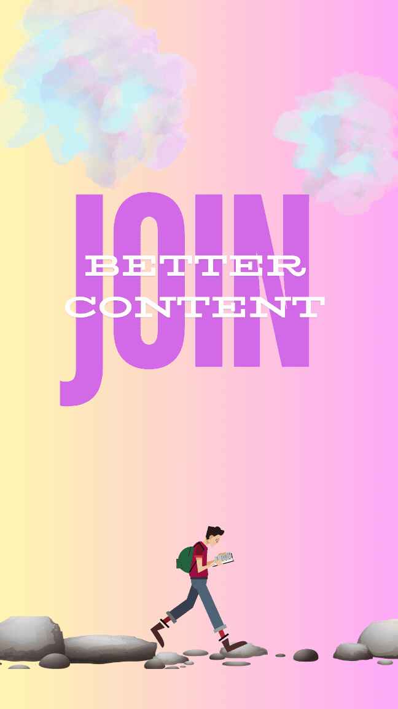

# About BetterContent

## Owner of Better Content

Maria Zhou (Master Student in Computer Science)

## App Showing

  

## Introduction

Better Content is a cross-platform mobile application available on both iOS and Android. It helps users decorate their content with high-quality serial images efficiently, thanks to OpenAI's advanced capabilities. The app supports a wide range of content types, including stories, poems, introductions, and more.

## Key Features:

1. **Effortless Decoration**: Automatically enhance content with relevant, high-quality images by calling a backend public server, encapsulating OpenAI's “gpt-3.5-turbo-instruct” and “dall-e-2” APIs. Users just need to upload .txt / .docx files, or copy text into the content field and click the "Better Content" button. 

2. **Robust Security**: 
   - Public server encapsulates OpenAI APIs, using trained prompts to provide high-quality decoration images.
   - Firebase Authorization provides user login verification, email confirmation for sign-up, and password reset.
   - Firebase Firestore Database stores user files after image decoration, offering secure and efficient data queries across devices.

3. **Data Synchronization**: Users can fetch their own saved content from different devices.

4. **Seamless Sharing**: Share your decorated content to other apps, save it locally, or print it.

5. **Easy File Management**: Users can easily save, delete, and share files locally.

6. **State Management**:  If interrupted, the text input or decoration style setting is preserved after app reloading, utilizing async-storage, which is a local storage solution in React Native for persisting data asynchronously across app restarts.

7. **Amazing UI**:
   - Use Canva to create a set of background GIFs or images, enhancing visualization.
   - Employ various external libraries to improve user experience, such as local file picking and decoration type selection.

## Video Demo

Watch a demo of the BetterContent App to how to use it.

[Video Demo Link]( https://youtu.be/2lj9nszsLVg) 
